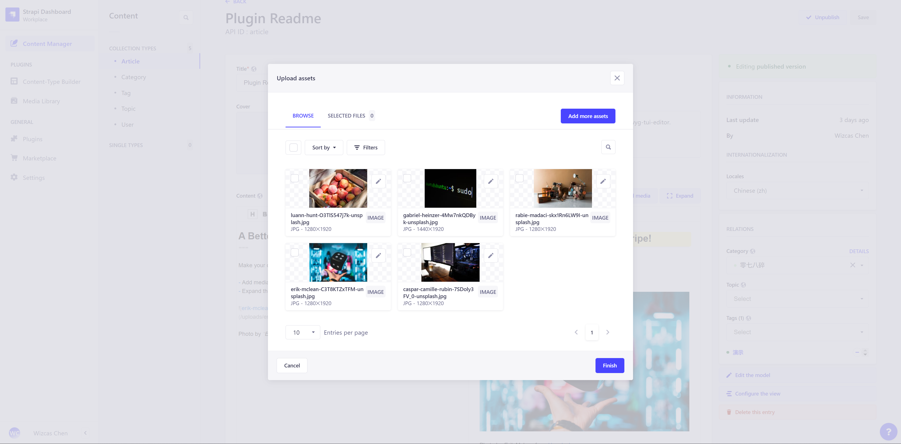
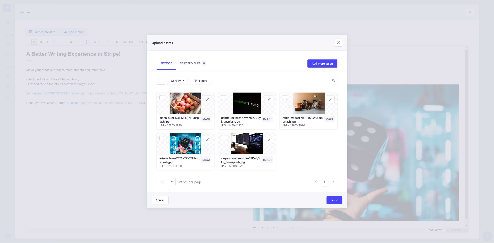

# strapi-plugin-wysiwyg-tui-editor

⚠️ **This is a strapi v4 plugin which does not support any earlier version!**


A [Strapi](https://strapi.io/) plugin to replace the default rich text editor with [ToastUI Editor](https://ui.toast.com/tui-editor)

## Features

This plugin:

- Supports the editing modes of both markdown and WYSIWYG.
- Allows you to add images from the strapi's media library.
- Can switch between two preview layouts, either by tab or side-by-side.
- Can expand the editor to full screen for large writing area.

## Installation

In the root of your strapi project, run:

With yarn:
```shell
yarn add strapi-plugin-wysiwyg-tui-editor
``` 

Or with npm:
```shell
npm install --save strapi-plugin-wysiwyg-tui-editor
```

## Screenshots

***Normal*** view 


***Expanded*** view


Media Library in ***normal*** view


Media Library in ***expanded*** view


## Development

In order to develop on this plugin, you'll need to clone into your Strapi project and link the dependency to it.

1. Make the folder *plugins* if you haven't already:
   ```shell
   mkdir -p <path_to_strapi_project>/src/plugins
   cd <path_to_strapi_project>/src/plugins
   ```
2. Clone the repo into the *plugins* folder:
   ```shell
   git clone https://github.com/wizcas/strapi-plugin-wysiwyg-tui-editor.git
   ```
3. Register a link to the cloned package:
   ```shell
   cd strapi-plugin-wysiwyg-tui-editor && yarn link
   ```
4. In your strapi's directory, link the local package as a dependency:
   ```shell
   cd <path_to_strapi_project> && yarn link strapi-plugin-wysiwyg-tui-editor
   ```


