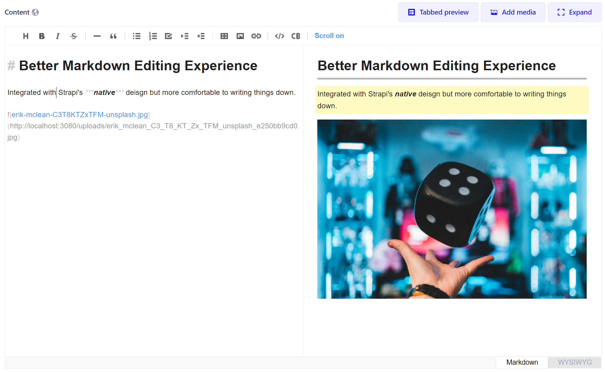
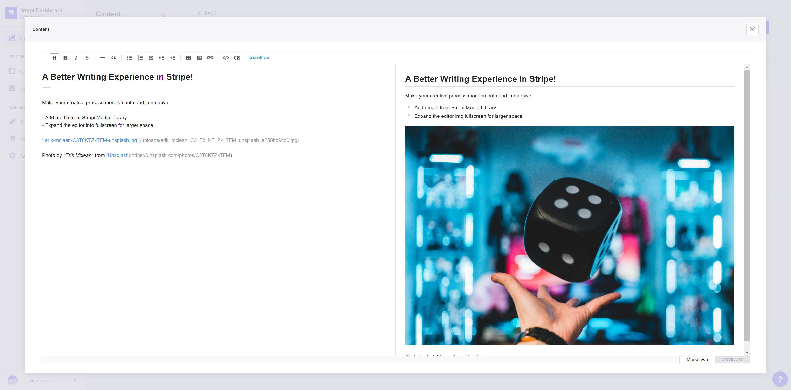

# strapi-plugin-wysiwyg-tui-editor

⚠️ **This is a strapi v4 plugin which does not support any earlier version!**


A [Strapi](https://strapi.io/) plugin to replace the default rich text editor with [ToastUI Editor](https://ui.toast.com/tui-editor)

## Features

This plugin:

- Supports the editing modes of both markdown and WYSIWYG.
- Allows you to add images from the strapi's media library.
- Can switch between two preview layouts, either by tab or side-by-side.
- Can expand the editor to full screen for large writing area.

## Installation

In the root of your strapi project, run:

With yarn:
```shell
yarn add strapi-plugin-wysiwyg-tui-editor
``` 

Or with npm:
```shell
npm install --save strapi-plugin-wysiwyg-tui-editor
```

## Screenshots

Normal view 


Expanded view
